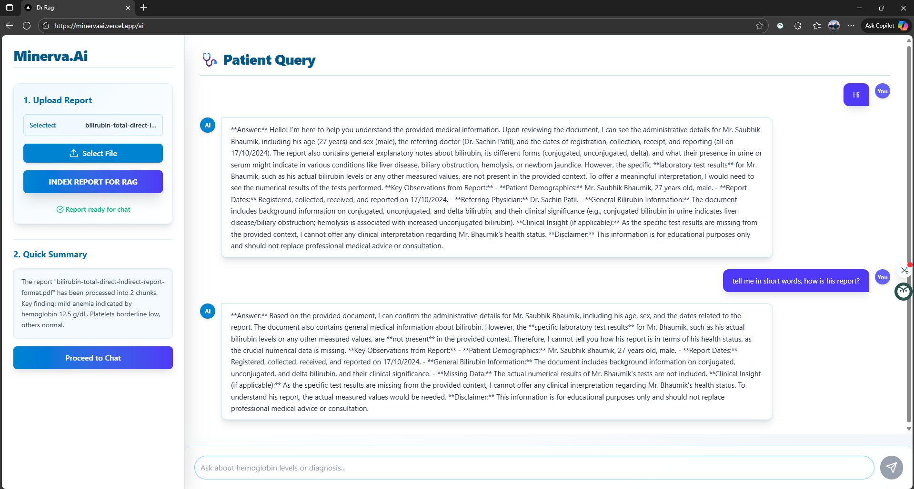

# Minerva.ai Learning Intelligence Platform

An AI-powered, full-stack education intelligence system designed to personalize learning, enhance engagement, and deliver real-time knowledge insights using Gemini, Pinecone, and adaptive analytics.

---

### ▶️ [Live Demo](https://minervaai.vercel.app/)

---

## 📖 About The Project

Minerva.ai is engineered to solve a core problem in personal health: translating dense, complex medical reports (like lab results, discharge summaries, or clinical notes) into clear, actionable, and contextual intelligence.

Unlike generic chatbots, Minerva.ai employs a strict Retrieval-Augmented Generation (RAG) architecture. When a user asks a question, the system retrieves relevant information only from their private, indexed reports using Pinecone's vector search before calling the Gemini Large Language Model (LLM) for synthesis. This guarantees that responses are grounded in the patient's specific data, dramatically reducing hallucination and increasing medical safety and accuracy.

The application features a secure, multi-stage user flow: File Upload -> Private Indexing -> Conversational Querying.

## 🌟 Key Features

- **Contextual RAG for Health**: Utilizes **Gemini Embeddings** and **Pinecone Vector Store** to index medical reports, ensuring the AI responds only using the patient's specific health data for accurate, context-aware answers.

- **Zero-Knowledge Architecture**: Implements full **client-side document processing**, where files are sent directly to a private Pinecone namespace. The Gemini model only accesses retrieved chunks — never the complete database — ensuring maximum data privacy.

- **Conversational Memory**: Employs **LangChain’s memory components** to maintain the full context of medical consultations, allowing the assistant to handle complex follow-up questions and multi-turn discussions intelligently.

- **Modern, Professional UI**: Features a sleek, medically trustworthy interface designed with **Tailwind CSS** and enriched with **Framer Motion** animations for smooth, responsive interactions.

- **Isolated Data Handling**: Every user’s report is indexed into a **dedicated Pinecone namespace**, ensuring strict isolation and data security for multi-user medical environments.

---

## 🔧 Tech Stack

This project combines modern web technologies and AI infrastructure to deliver an adaptive, context-aware learning experience.

| Technology | Role & Justification |
| :---------- | :------------------ |
| **Next.js (TypeScript)** | **Frontend Framework**: Provides a performant, type-safe, SSR-enabled client for smooth and dynamic UI experiences. |
| **Gemini AI** | **Core AI Engine**: Powers chat-based tutoring, document summarization, and contextual understanding. |
| **Pinecone** | **Vector Database**: Stores embeddings for semantic search, enabling concept-based retrieval and similarity queries. |
| **Tailwind CSS** | **UI Framework**: Builds a consistent, dark-themed design with rapid, utility-first styling. |
| **Vercel** | **Deployment**: Frontend and backend services on Vercel for smooth CI/CD and scaling. |

---

